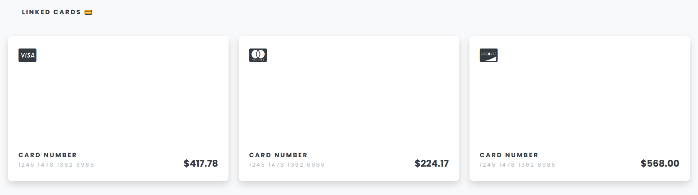
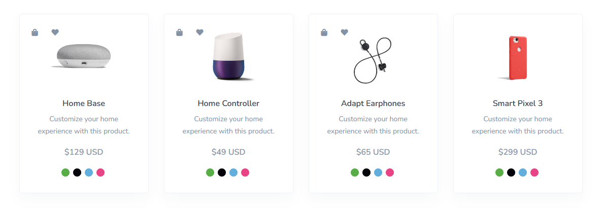
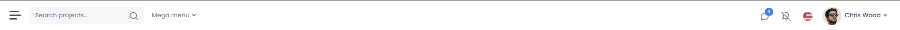
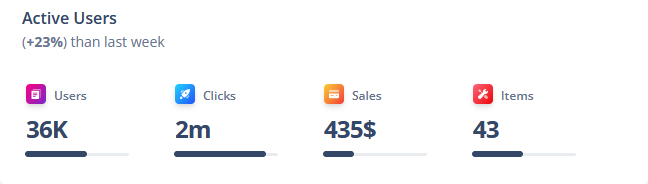

# CSS Layouts

Very early in your web development journey, you will encounter difficulties in the positioning of elements in the page.  

To help developers accomplish their goals, CSS provides a variety of features whose purpose is making element positioning easier. Two of the most used are <b>grid</b> and <b>flexbox</b>.  
Both of these features consist of creating a "container" element (does not have to be named like this) which controls the positioning of direct childs. After that, for each child, different properties can be set up.

## Useful links

In our opinion, the following websites provide a very good explanation for the use of both flexbox and grid:
 - [Grid Guide](https://css-tricks.com/snippets/css/complete-guide-grid/)
 - [Flexbox Guide](https://css-tricks.com/snippets/css/a-guide-to-flexbox/)  

We recommend reading these 2 articles carefully and practicing each property described, as you will use them a lot in every web dev project.

## Homework

Even though grid and flexbox become very easy to use once mastered, they might seem a little counter-intuitive at the beginning. This is why a lot of practice is required.

 1. Read and exercise on the guides provided
 2. Replicate one of the following:
    - Card showcase
    
    [ref link](https://themes.getbootstrap.com/preview/?theme_id=88616)

    - Product showcase
    
    [ref link](https://themes.getbootstrap.com/preview/?theme_id=5348) - Pages -> Shop -> Products

    - Navbar
    
    [ref link](https://appstack.bootlab.io/dashboard-analytics.html)  
    Try to replicate as much of the functionality as possible

    - Analytics
    
    [ref link](https://themes.getbootstrap.com/preview/?theme_id=93682)